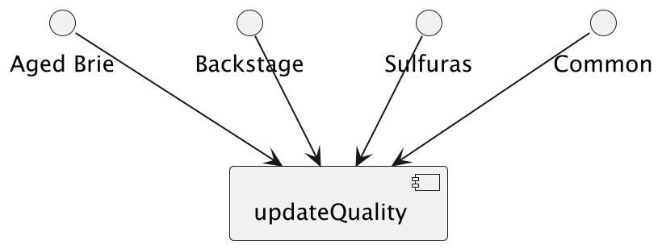
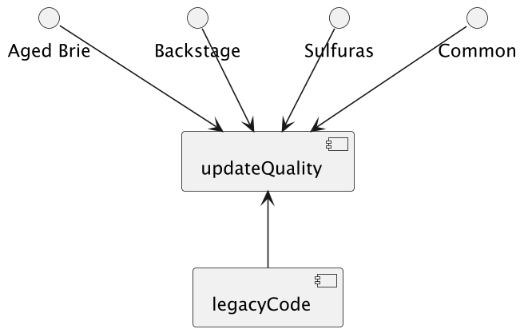
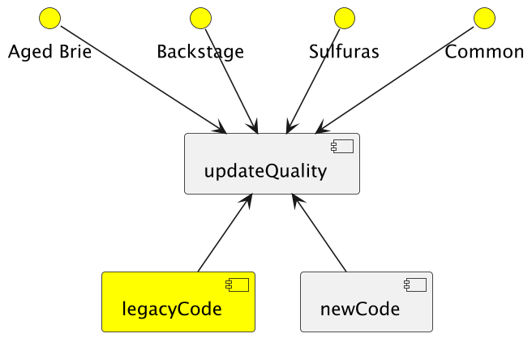
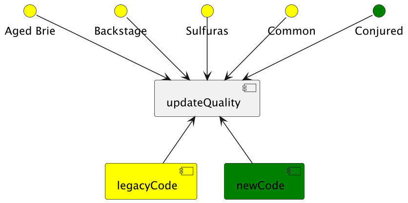
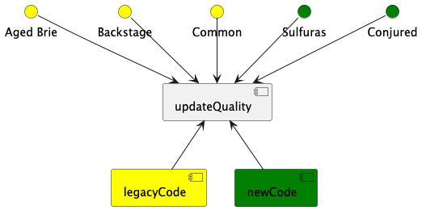
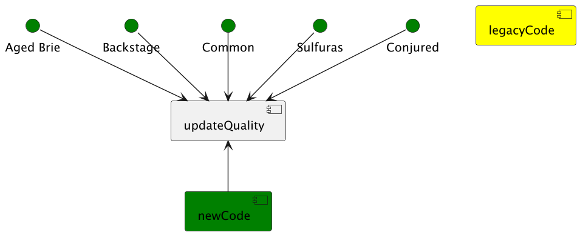

# Compreensão do estado atual

# Criação da abstração

# Ramificação por item

# Novo item na nova ramificação

# Para cada oportunidade nova, migrar para nova ramificação

# Remover quando tudo estiver migrado

